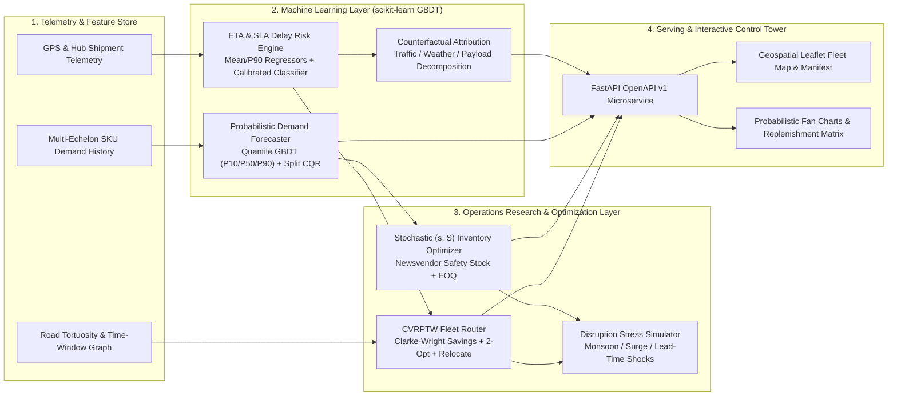

# LogiRoute AI — Enterprise Supply Chain & Logistics Intelligence Platform

[](.github/workflows/ci.yml)
[](pyproject.toml)
[](logiroute/api/main.py)
[](pyproject.toml)

**LogiRoute AI** is a full-stack Machine Learning & Operations Research (ML/OR) platform engineered for modern supply chain control towers and regional fleet logistics. It unifies **Probabilistic Demand Forecasting (Conformalized Quantile Gradient Boosted Trees)**, **Traffic & Weather-Aware ETA & SLA Delay Risk Prediction**, **Capacitated Vehicle Routing with Time Windows (`CVRPTW`)**, and **Multi-Echelon Stochastic Inventory Optimization (`(s, S)` Policy)** inside a real-time interactive Control Tower dashboard and REST API.

---

## System Architecture



---

## Core AI/ML & Operations Research Capabilities

### 1. Conformalized Quantile Demand Forecasting (`logiroute/models/demand_forecaster.py`)
- **Feature Engineering**: Cyclical Fourier calendar encodings ($\sin/\cos$ day-of-week & day-of-year), autoregressive lags ($t-1, t-7, t-14, t-28$), rolling volatility ($\mu_7, \sigma_7, \mu_{14}, \mu_{28}$), EWMA momentum, price elasticity indices, promotional uplifts, and weather severity covariates.
- **Model Architecture**: Three `HistGradientBoostingRegressor` models trained with pinball/quantile loss at $\tau \in \{0.10, 0.50, 0.90\}$.
- **Conformalized Quantile Regression (CQR)**: Applies split conformal calibration (Romano et al., NeurIPS 2019) using nonconformity scores $E_i = \max(\hat{q}_{0.10}(x_i) - y_i,\; y_i - \hat{q}_{0.90}(x_i))$ and enforces non-crossing quantile monotonicity ($\hat{y}_{P10} \le \hat{y}_{P50} \le \hat{y}_{P90}$), achieving **81.78% empirical coverage** on out-of-time holdout data.

### 2. Traffic & Weather-Aware ETA & SLA Delay Risk (`logiroute/models/eta_predictor.py`)
- **Multi-Head Inference**: Simultaneously predicts expected transit duration ($\text{MAE} = 2.56\text{ min}, R^2 = 0.9940$), 90th-percentile tail duration ($P_{90}$), and calibrated SLA breach probability ($\text{ROC-AUC} = 0.9908, \text{Brier Score} = 0.0455$).
- **Counterfactual Attribution**: Decomposes predicted travel minutes into **Base Free-Flow Transit**, **Traffic Congestion Delay**, **Weather & Road Friction**, and **Payload & Dock Handling**, pairing every prediction with prescriptive dispatch actions.

### 3. Capacitated Vehicle Routing with Time Windows (`logiroute/optimization/vrp_solver.py`)
- **Three-Stage Combinatorial Solver**:
  1. **Clarke-Wright Parallel Savings Construction**: Merges delivery pairs $(i, j)$ maximizing $s_{ij} = d_{0i} + d_{0j} - d_{ij} - \lambda |\text{TW}_i - \text{TW}_j|$ subject to vehicle capacity constraints.
  2. **Intra-Route 2-Opt Local Search**: Iteratively eliminates route crossings by reversing sub-tours that reduce closed-tour road distance.
  3. **Inter-Route Relocate Search & Heterogeneous Fleet Assignment**: Balances stop assignments across routes and assigns each tour to the optimal vehicle class (`Zero-Emission EV Cargo Van 4.5T`, `Medium Regional Box Truck 9T`, or `Heavy Refrigerated Truck 16T`).

### 4. Multi-Echelon Stochastic Inventory Optimization (`logiroute/optimization/inventory_optimizer.py`)
- Computes continuous-review $(s, S)$ replenishment policies under joint demand ($\mu_D, \sigma_D$) and supplier lead-time ($\mu_L, \sigma_L$) uncertainty:
  $$\sigma_{DL} = \sqrt{\mu_L \sigma_D^2 + \mu_D^2 \sigma_L^2}, \qquad SS = \lceil z_{\alpha} \sigma_{DL} \rceil, \qquad ROP = \lceil \mu_D \mu_L + SS \rceil, \qquad EOQ = \left\lceil \sqrt{\frac{2 D_{\text{annual}} K}{h \cdot C}} \right\rceil$$

---

## Verified Benchmark Performance

| Module | Metric | Benchmark Result |
| :--- | :--- | :--- |
| **Probabilistic Demand Forecaster** | Out-of-Time Holdout WMAPE | **7.86%** (92.14% Accuracy) |
| **Probabilistic Demand Forecaster** | Out-of-Time Holdout $R^2$ | **0.9579** |
| **Probabilistic Demand Forecaster** | CQR 80% Interval Coverage ($[P_{10}, P_{90}]$) | **81.78%** |
| **ETA & SLA Risk Predictor** | Holdout ETA Mean Absolute Error (MAE) | **2.56 min** |
| **ETA & SLA Risk Predictor** | SLA Breach Classification ROC-AUC | **0.9908** |
| **ETA & SLA Risk Predictor** | Brier Probability Calibration Score | **0.0455** |
| **CVRPTW Route Optimizer** | Fleet Distance vs. Unoptimized Baseline | **342.63 km vs. 612.39 km (-44.0%)** |
| **CVRPTW Route Optimizer** | Daily Dispatch Cost Reduction | **-$843.04 / day (-54.4%)** |
| **CVRPTW Route Optimizer** | Daily Carbon Emissions Avoided | **251.03 kg $\text{CO}_2\text{e}$** |

---

## Repository Structure

```text
logiroute-/
├── .github/workflows/ci.yml          # Automated GitHub Actions MLOps CI pipeline
├── docs/
│   └── architecture.md               # Mathematical formulations & design deep dive
├── logiroute/
│   ├── __init__.py
│   ├── config.py                     # Regional hub network, SKUs, fleet & solver settings
│   ├── schemas.py                    # Strict Pydantic v2 data contracts
│   ├── cli.py                        # CLI runner for training, evaluation & simulation
│   ├── api/
│   │   └── main.py                   # FastAPI microservice + static Control Tower server
│   ├── data/
│   │   └── synthetic_generator.py    # Deterministic demand, telemetry & manifest generator
│   ├── models/
│   │   ├── demand_forecaster.py      # Quantile GBDT + Conformalized Quantile Regression
│   │   └── eta_predictor.py          # Traffic/weather ETA regressor & SLA classifier
│   ├── optimization/
│   │   ├── vrp_solver.py             # Clarke-Wright + 2-Opt + Relocate CVRPTW solver
│   │   └── inventory_optimizer.py    # Stochastic (s, S) & Newsvendor safety stock engine
│   ├── pipeline/
│   │   └── orchestrator.py           # Unified Control Tower orchestrator & stress simulator
│   └── web/static/                   # Interactive Control Tower UI (Leaflet + Chart.js)
│       ├── index.html
│       ├── styles.css
│       └── app.js
├── tests/
│   └── test_logiroute.py             # End-to-end pytest unit & API integration suite
├── Dockerfile
├── docker-compose.yml
├── pyproject.toml
└── requirements.txt
```

---

## Quickstart Guide

### 1. Local Installation

```bash
python3 -m venv .venv
source .venv/bin/activate
pip install -r requirements.txt
pip install -e .
```

### 2. Run MLOps CLI Evaluation & Disruption Simulation

```bash
# Train models, solve CVRPTW & Inventory policies, and print benchmark report
python -m logiroute.cli --evaluate

# Simulate a severe Monsoon Corridor Disruption scenario
python -m logiroute.cli --simulate "Monsoon Disruption" --demand-mult 1.25 --traffic 0.80 --weather 0.85
```

### 3. Launch Interactive Control Tower & FastAPI Server

```bash
uvicorn logiroute.api.main:app --host 0.0.0.0 --port 8000
```

- **Interactive Control Tower UI**: `http://localhost:8000/`
- **Interactive OpenAPI Documentation**: `http://localhost:8000/docs`

### 4. Run Automated Test Suite

```bash
pytest -v
```

---

## REST API Reference (`/api/v1`)

| Method | Endpoint | Description |
| :--- | :--- | :--- |
| `GET` | `/api/v1/health` | Service health & ML model readiness check |
| `GET` | `/api/v1/overview` | Full Control Tower state (KPIs, routes, forecast, inventory, diagnostics) |
| `GET` | `/api/v1/catalog` | Network hubs, SKU master catalog, and heterogeneous vehicle classes |
| `POST` | `/api/v1/routes/optimize` | Run CVRPTW solver with custom demand, traffic, weather, and 2-Opt settings |
| `GET` | `/api/v1/forecast` | Multi-horizon P10/P50/P90 demand forecast for any `(sku_id, hub_id)` |
| `POST` | `/api/v1/eta/predict` | Predict shipment ETA, P90 tail duration, SLA risk, and factor attributions |
| `GET` | `/api/v1/inventory/optimize` | Compute continuous-review $(s, S)$ safety stock & replenishment orders |
| `POST` | `/api/v1/scenarios/simulate` | Stress-test network resilience under compound supply chain disruptions |
